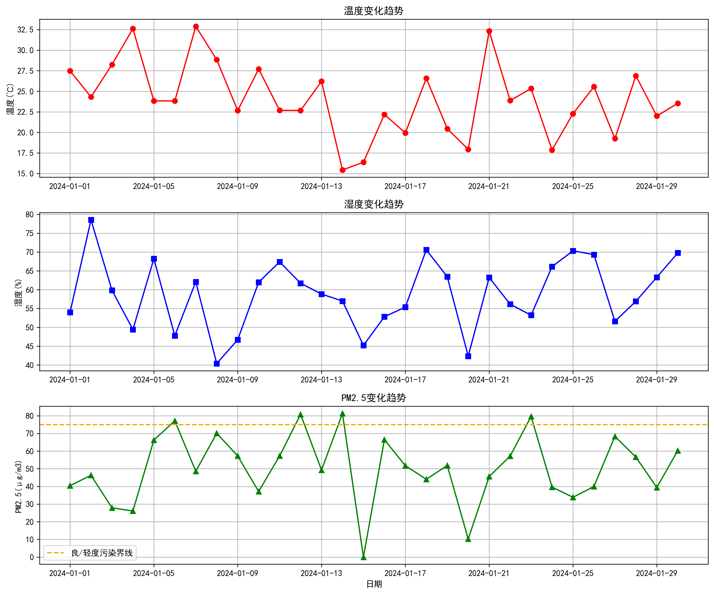
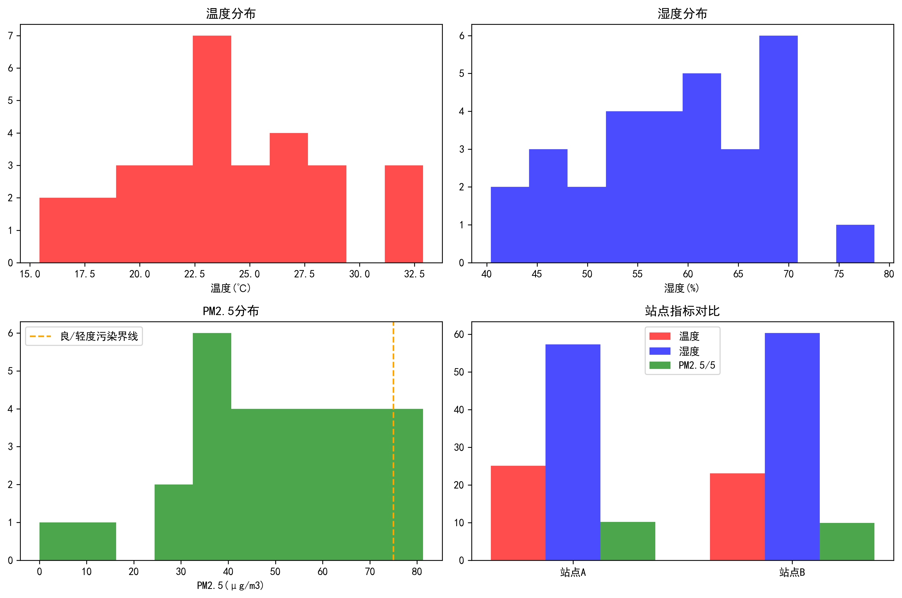
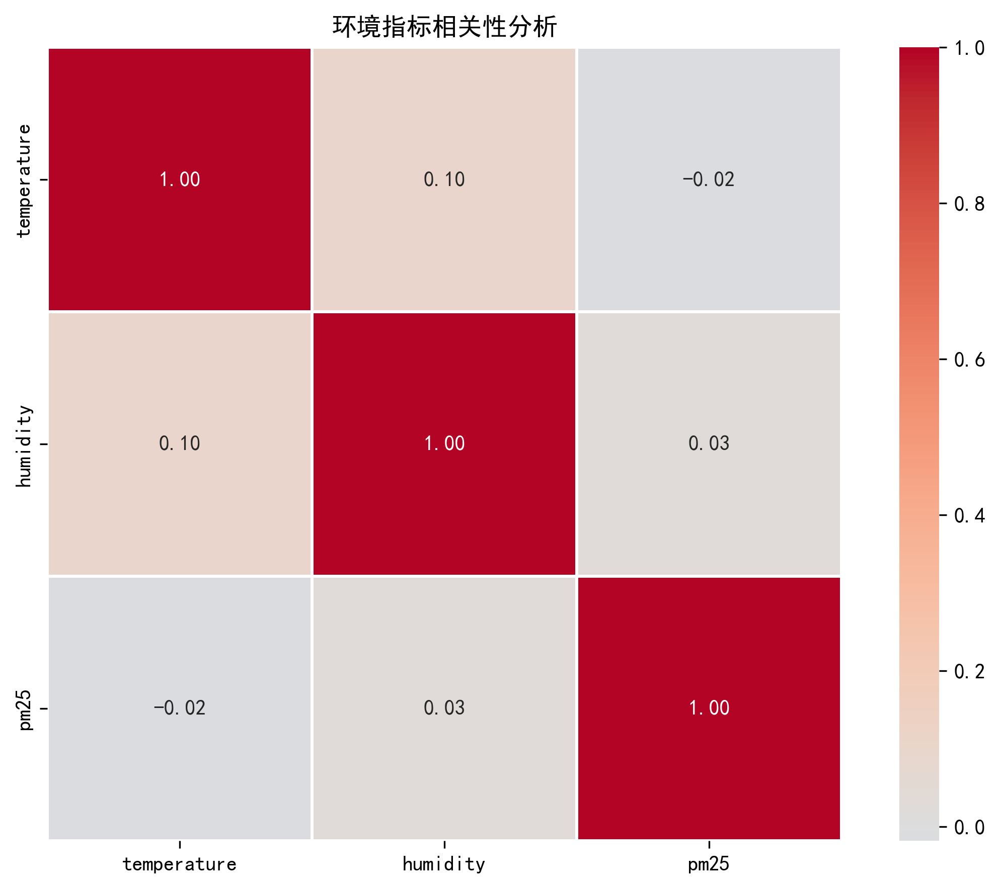

# 🌍 环境监测数据分析系统

<p align="center">
  
  
  
  
</p>

## 📖 项目简介

本项目是一个基于 Python 的环境监测数据分析系统，用于处理和分析环境传感器采集的数据，包括温度、湿度、PM2.5等指标，并生成可视化分析报告。

### ✨ 主要功能

- 📊 **数据加载**：自动读取CSV格式的传感器数据
- 📈 **统计分析**：多维度统计分析（基础统计、站点对比、时间趋势）
- 🌤️ **空气质量评估**：基于PM2.5指标的空气质量分级
- 📉 **数据可视化**：生成时间序列图、分布图、相关性热图
- 🏢 **站点对比**：多监测站点数据对比分析

---

## 🚀 快速开始

### 环境要求

- Python 3.10 或更高版本
- Git 2.0 或更高版本

### 安装步骤

```bash
# 1. 克隆项目
git clone https://github.com/你的用户名/env-monitor-system.git
cd env-monitor-system

# 2. 安装依赖包
pip install -r requirements.txt

# 3. 生成模拟数据
python data/generate_data.py

# 4. 运行主程序
python src/main.py

### 预期输出

程序运行后将生成以下文件：

```
docs/
├── timeseries.png    - 时间序列趋势图
├── distribution.png  - 数据分布图
└── correlation.png   - 相关性热图
```

---

## 📁 项目结构

```
env-monitor-system/
│
├── data/                     # 数据目录
│   ├── generate_data.py      # 数据生成脚本
│   └── sensor_data.csv       # 传感器数据
│
├── src/                      # 源代码目录
│   ├── __init__.py           # 包初始化文件
│   ├── data_loader.py        # 数据加载模块
│   ├── data_analysis.py      # 数据分析模块
│   ├── visualization.py      # 可视化模块
│   └── main.py               # 主程序入口
│
├── docs/                     # 文档目录
│   ├── report.md             # 项目报告
│   ├── timeseries.png        # 时间序列图
│   ├── distribution.png      # 分布图
│   └── correlation.png       # 相关性图
│
├── tests/                    # 测试目录
│
├── .gitignore                # Git 忽略文件
├── README.md                 # 项目说明文档
└── requirements.txt          # 依赖包列表
```

---

## 💻 使用示例

### 基础使用

```python
from src.data_loader import DataLoader
from src.data_analysis import DataAnalyzer
from src.visualization import DataVisualizer

# 加载数据
loader = DataLoader()
data = loader.load_data()

# 数据分析
analyzer = DataAnalyzer(data)
print(analyzer.basic_statistics())

# 生成图表
visualizer = DataVisualizer(data)
visualizer.plot_time_series()
```

### 自定义数据路径

```python
# 使用自定义数据文件
loader = DataLoader('your/custom/path/data.csv')
data = loader.load_data()
```

---

## 📊 数据格式

### 输入数据格式（CSV）

| 列名        | 类型   | 说明      | 单位       |
| ----------- | ------ | --------- | ---------- |
| date        | string | 监测日期  | YYYY-MM-DD |
| temperature | float  | 温度      | ℃          |
| humidity    | float  | 湿度      | %          |
| pm25        | float  | PM2.5浓度 | μg/m³      |
| location    | string | 监测站点  | -          |

### 示例数据

```csv
date,temperature,humidity,pm25,location
2024-01-01,27.5,58.3,52.1,站点A
2024-01-02,22.8,65.7,48.3,站点A
```

---

## 🔧 功能模块说明

### 1. 数据加载模块（data_loader.py）

**功能**：

- 读取CSV格式数据
- 数据类型转换
- 数据验证
- 提供数据摘要

**核心类**：`DataLoader`

**主要方法**：

- `load_data()`: 加载数据
- `get_data()`: 获取数据
- `get_summary()`: 获取数据摘要

### 2. 数据分析模块（data_analysis.py）

**功能**：

- 基础统计分析
- 站点对比分析
- 时间趋势分析
- 空气质量评估
- 温度极值分析

**核心类**：`DataAnalyzer`

**主要方法**：

- `basic_statistics()`: 基础统计
- `location_analysis()`: 站点分析
- `time_trend()`: 时间趋势
- `air_quality_assessment()`: 空气质量评估
- `temperature_extremes()`: 温度极值

### 3. 可视化模块（visualization.py）

**功能**：

- 生成时间序列图
- 生成数据分布图
- 生成相关性热图

**核心类**：`DataVisualizer`

**主要方法**：

- `plot_time_series()`: 时间序列图
- `plot_distribution()`: 分布图
- `plot_correlation()`: 相关性图

---

## 📈 示例结果

### 时间序列分析



### 数据分布分析



### 指标相关性分析



---

## 🛠️ 技术栈

| 技术       | 版本   | 用途       |
| ---------- | ------ | ---------- |
| Python     | 3.13.7 | 编程语言   |
| Pandas     | 2.0.0  | 数据处理   |
| NumPy      | 1.24.0 | 数值计算   |
| Matplotlib | 3.7.0  | 数据可视化 |
| Seaborn    | 0.12.0 | 统计图表   |
| Git        | 2.52.0 | 版本控制   |

---

## 📝 开发日志

### Version 1.0.0 (2024-01-XX)

**新功能**：

- ✅ 实现数据加载功能
- ✅ 实现基础统计分析
- ✅ 实现数据可视化
- ✅ 添加空气质量评估

**已知问题**：

- 暂不支持大数据量处理
- 缺少异常值自动检测功能

---

## 🤝 贡献指南

欢迎贡献代码！请遵循以下步骤：

1. Fork 本项目
2. 创建新分支 (`git checkout -b feature/AmazingFeature`)
3. 提交更改 (`git commit -m 'Add some AmazingFeature'`)
4. 推送到分支 (`git push origin feature/AmazingFeature`)
5. 创建 Pull Request

---

## 📄 许可证

本项目采用 MIT 许可证 - 详见 [LICENSE](LICENSE) 文件

---

## 👥 作者

- **姓名**：2300XBMZ
- **邮箱**：3237486974@qq.com
- **GitHub**：[@2300XBMZ](https://github.com/2300XBMZ)

---

## 🙏 致谢

感谢以下开源项目：

- [Pandas](https://pandas.pydata.org/)
- [Matplotlib](https://matplotlib.org/)
- [Seaborn](https://seaborn.pydata.org/)

---

## 📞 联系方式

如有问题或建议，欢迎通过以下方式联系：

- 📧 Email: 3237486974@qq.com
- 💬 GitHub Issues: [提交Issue](https://github.com/2300XBMZ/env-monitor-system/issues)

---

## 🔗 相关链接

- [项目主页](https://github.com/2300XBMZ/env-monitor-system)
- [在线文档](https://github.com/2300XBMZ/env-monitor-system/wiki)
- [问题反馈](https://github.com/2300XBMZ/env-monitor-system/issues)
